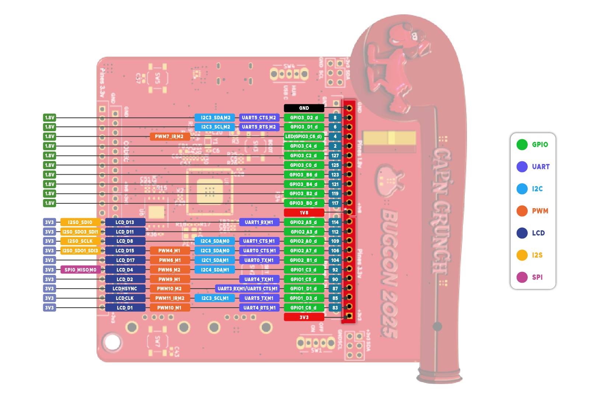
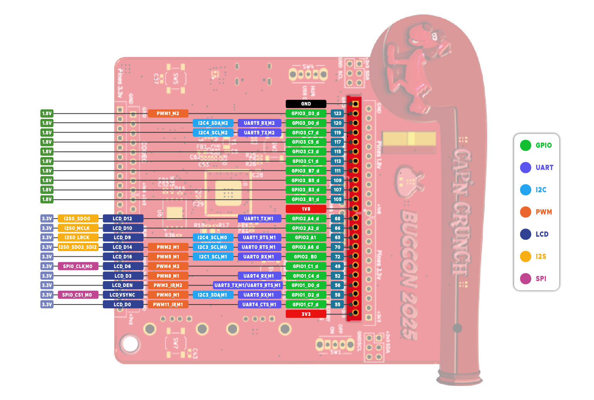
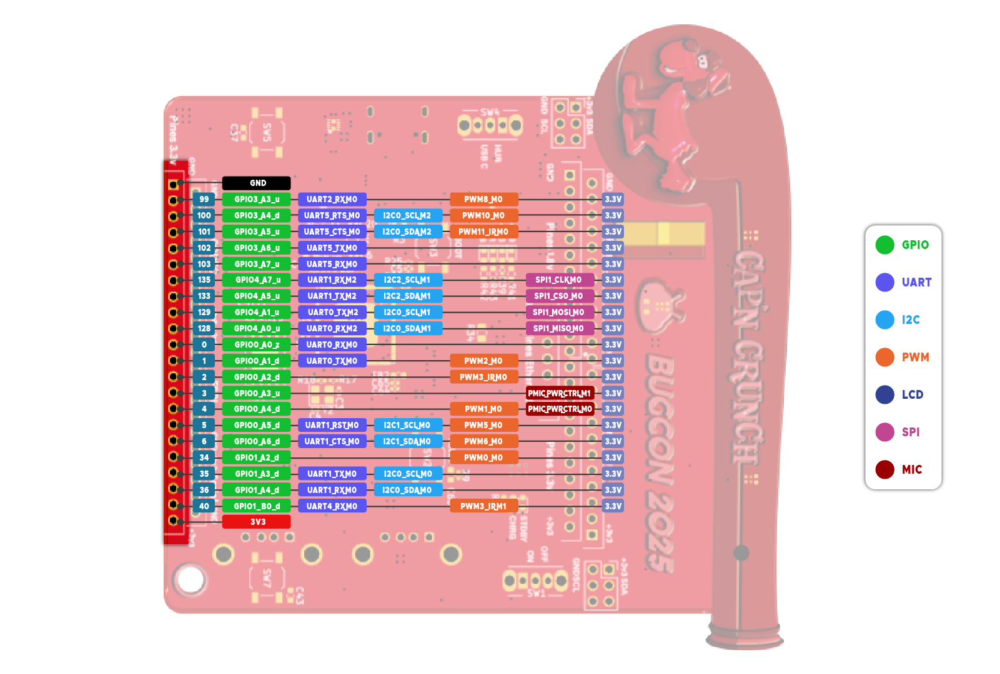
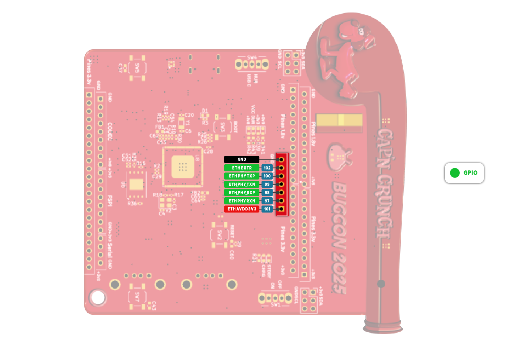

# Badge BugCon 2025

El Badge BugCon 2025 es un dispositivo de hardware abierto diseñado para la comunidad de hackers, desarrolladores y entusiastas de la tecnología. Cuenta con un potente procesador Linux que permite ejecutar aplicaciones personalizadas, y una amplia gama de interfaces para expandir sus capacidades.

## 🚀 Características Principales

### Procesador Principal
- **RV1106**: Procesador Linux de alto rendimiento
  - Integra ARM Cortex-A7 y RISC-V MCU
  - NPU (Neural Processing Unit) integrada
  - ISP (Image Signal Processor) para procesamiento de imágenes
  - Soporte completo para sistemas operativos Linux

### Interfaces y Conectividad
- **GPIOs**: Múltiples pines de propósito general para expansión
- **MIPI CSI**: Interfaz para cámaras y sensores de imagen
- **UART**: Comunicación serial asíncrona
- **SPI**: Bus serie para comunicación con periféricos
- **I2C**: Bus de comunicación para sensores y displays
- **USB**: Puerto USB con Hub integrado
- **Ethernet**: GPIO para Puerto Ethernet para conectividad de red cableada

### Periféricos Integrados
- **Neopixels**: LEDs WS2812E programables RGB
- **Batería**: Soporte para batería 18650 con gestión de energía
- **Buck Converter**: Conversor DC-DC para gestión eficiente de energía
- **USB-A**: Conector USB-A para dispositivos externos

## 📦 Componentes del Proyecto

El proyecto está dividido en dos partes principales:

### 1. Badge Principal (`Badge_Bugcon_2025/`)
Contiene el diseño principal del badge con:
- Procesador RV1106G3
- Pantalla OLED 128x32
- LEDs Neopixels WS2812E
- Gestión de energía y batería
- Interfaces USB

### 2. Add-on (`Add_On_Bugcon_2025/`)
Placa de expansión adicional con:
- Microcontrolador PY32F002AA15M
- Componentes adicionales para expansión
- Diseño decorativo personalizado

## 📋 Especificaciones Técnicas

| Componente | Especificación |
|------------|----------------|
| Procesador | RV1106G3 (ARM Cortex-A7 + RISC-V MCU + NPU + ISP) |
| Sistema Operativo | Linux |
| LEDs | WS2812E Neopixels |
| Batería | Soporte 18650 |
| Interfaces | USB, Ethernet, UART, SPI, I2C, MIPI CSI, GPIOs |


## 🔌 Interfaces del RV1106

El procesador RV1106 ofrece las siguientes interfaces:

### Comunicación
- **UART**: Para comunicación serial (debug, terminal, etc.)
- **SPI**: Para comunicación con periféricos de alta velocidad
- **I2C**: Para sensores, displays y otros dispositivos I2C
- **USB**: Puerto USB con Hub integrado para múltiples dispositivos

### Red
- **Ethernet**: GPIOs para Puerto Ethernet para conectividad cableada

### Multimedia e Imagen
- **MIPI CSI**: Interfaz para cámaras y sensores de imagen
- **ISP**: Procesador de señal de imagen integrado

### Control
- **GPIOs**: Múltiples pines de propósito general
- **PWM**: Canales PWM para control de LEDs y motores


# Getting Started

The Bugcon 2025 badge is built on the Luckfox Pico Pro Max hardware and SDK. For general information, please refer to the official Luckfox Wiki. The badge features the RV1106G3, a low-power, highly integrated microprocessor from Rockchip, based on a 32-bit RISC-V CPU optimized for audio and video encoding/decoding applications. 

The badge supports multiple interfaces, including GPIO, UART, SPI, I2C, USB, etc., facilitating rapid development and debugging for developers.Please note that communication with the badge will take place through the serial interface, specifically using the pins indicated in the image.


In the diagrams below, you can see the pinout for the different protocols available on the badge. It is important to note that only bus 0 of the SPI, I²C, and UART protocols is active by default. To enable any other protocol, please refer to the device trees source.







The pin numbers corresponding to GPIOs are marked in the pinout diagram. You could use it to configure a pin as a gpio.
For more information, please refer to the gpio luckfox wiki.

- [GPIO](https://wiki.luckfox.com/Luckfox-Pico-Pro-Max/Flash-image)

The board also is compatible with 10/100 Mbps ethernet. Please notice that you need to add the ethernet transformer and the common-mode choker for the proper function of the device.



Finally, the board also allows external analog microphones to be connected to it through codec input. The CPU can also output PCM (Pulse-Code Modulation) digital audio signals locally, which can be converted to analog signals for playback. It is important to note that the analog signal used for playback requires its own amplifier to prevent current-related issues.


For more information, please refer to the audio luckfox wiki

- [Audio](https://wiki.luckfox.com/Luckfox-Pico-Pro-Max/Flash-image)

IMPORTANT: Please do not use the FSPI pins. Those are connected directly to the flash memory. Any change in its signal may cause the badge to malfunction.
Please notice that 

## Device tree source 

The Device Tree is used in the Linux kernel to describe a board’s hardware.
It is written in text files with the extensions .dts (Device Tree Source) and .dtsi (Device Tree Source Include).
The .dts file defines the specific hardware for a board, while the .dtsi file contains shared or common configurations used by multiple .dts files. 

You can use the DTS to enable, desable and/or configure the different peripherals that the board can offer
The device tree files are located in the following directory of the SDK:

```
 luckfox-pico SDK/sysdrv/source/kernel/arch/arm/boot/dts
```
For more information, please refer to the DTS luckfox wiki

- [DTS](https://wiki.luckfox.com/Luckfox-Pico-Ultra/Device-Tree)

## Hola Mundo
The badge already includes Python 3.11.6, so you can run Python scripts directly from the terminal without any additional setup.

This short guide shows how to create and run a simple “Hello World” program.

1. In the terminal, create a new file 

```
nano name.py
```
or
```
vi name.py
```

Add this line:
```
print("Hello world!")
```
2. Execute the file

```
python3 hello.py
```

you should see
```
Hello world!
``` 

## NEOPIXELS

The RGB LEDs WS2812B and WS2812E-1313 can be controlled using the Python **spidev** module through the SPI interface of the RV1106.  
It is important to note that SPI is used as an 800 kHz pulse train generator, which is required for the proper operation of the NeoPixel.

Once enabled the modules in the configuration interface and flashed the board, the next step will be to create a python scrip in the buildroot environment inside the pcb.
```
nano /root/[name of the scrip].py
```
It can be something like this:

```
#!/usr/bin/env python3
import spidev, time, threading

SPI_SPEED_HZ = 2400000
NUM_LEDS = 8

def byte_to_spi(byte):
    spi_bytes = []
    for i in range(8):
        if byte & (1 << (7-i)):
            spi_bytes.append(0b1110)  # '1'
        else:
            spi_bytes.append(0b1000)  # '0'
    return spi_bytes

def color_to_spi(r, g, b):
    data = []
    data += byte_to_spi(g)
    data += byte_to_spi(r)
    data += byte_to_spi(b)
    return data

def make_buffer(r, g, b):
    buf = []
    for _ in range(NUM_LEDS):
        buf += color_to_spi(r, g, b)
    return buf

def run_spi(bus, device, colors):
    spi = spidev.SpiDev()
    spi.open(bus, device)
    spi.max_speed_hz = SPI_SPEED_HZ

    try:
        while True:
            for (r,g,b) in colors:
                buffer = make_buffer(r,g,b)
                spi.xfer2(buffer)
                time.sleep(1)
    except KeyboardInterrupt:
        spi.xfer2(make_buffer(0,0,0))
        spi.close()

def main():
    colors = [(255,0,255), (0,255,0), (0,0,255)]  # rosa, verde, azul

    t0 = threading.Thread(target=run_spi, args=(0,0,colors))
    t1 = threading.Thread(target=run_spi, args=(1,0,colors))

    t0.start()
    t1.start()

    t0.join()
    t1.join()

if __name__ == "__main__":
    main()

```
The scrip controls both the WS2812B and WS2812B-1313 LEDs through **spi0** and **spi1** , cycling between four different colors (blue, red, green, and pink) every second.
Once created, run the scrip:
```
python3 /root/[name of the scrip].py
```

# Image Flashing

In this README, we will refer to the flashing method for Linux-based operating systems. For Windows or macOS, please refer to the official Luckfox flashing page:

- [Flashing image](https://wiki.luckfox.com/Luckfox-Pico-Pro-Max/Flash-image)

1.Press and hold the BOOT button while connecting the board to the host PC to enter flash mode.

2. After running the lsusb, you should see the device recognition results as below: 

```
Bus 003 Device 005: ID 2207:110c Fuzhou Rockchip Electronics Company 
```

3. Once you have the board in BOOt mode proceed to flash the board. You can do that from the main carpet in luckfox (The one who has the rkflash.sh file).

```
sudo ./rkflash.sh update
```


## 📖 Documentación Adicional

- [KiCad Documentation](https://docs.kicad.org/)
- [RV1106 Datasheet](https://www.rock-chips.com/a/en/products/RV11_Series/2022/0601/1553.html)
- [Proyecto Basado en LuckFox](https://wiki.luckfox.com/Luckfox-Pico-RV1106)

## 🤝 Contribuciones

Este es un proyecto de hardware abierto. Las contribuciones son bienvenidas:

1. Fork el proyecto
2. Crea una rama para tu feature (`git checkout -b feature/AmazingFeature`)
3. Commit tus cambios (`git commit -m 'Add some AmazingFeature'`)
4. Push a la rama (`git push origin feature/AmazingFeature`)
5. Abre un Pull Request

## 📝 Licencia

Este proyecto es de hardware abierto. Consulta los archivos de licencia para más detalles.

## 🏢 Electronic Cats

Desarrollado con ❤️ por [Electronic Cats](https://www.electroniccats.com/)

<a href="https://github.com/sponsors/ElectronicCats">

</a>

Electronic Cats invierte tiempo y recursos proporcionando este diseño de hardware abierto. ¡Por favor apoya a Electronic Cats y al hardware abierto comprando productos de Electronic Cats!

## 📞 Contacto y Soporte

- **Website**: [https://www.electroniccats.com/](https://www.electroniccats.com/)
- **GitHub**: [ElectronicCats](https://github.com/ElectronicCats)
- **Issues**: Utiliza la sección de Issues de GitHub para reportar problemas o sugerir mejoras

## 🙏 Agradecimientos

Gracias a toda la comunidad de hardware abierto y a todos los que hacen posible proyectos como este.

---

**Nota**: Este badge está diseñado para BugCon 2025. Para más información sobre el evento, visita la página oficial de BugCon.
