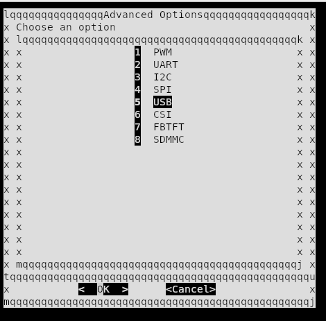
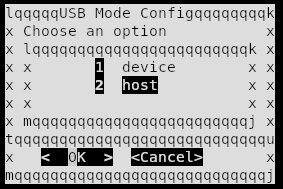

# Badge BugCon 2025

El Badge BugCon 2025 es un dispositivo de hardware abierto diseñado para la comunidad de hackers, desarrolladores y entusiastas de la tecnología. Cuenta con un potente procesador Linux capaz de ejecutar aplicaciones personalizadas, junto con una amplia variedad de interfaces para ampliar su funcionalidad.

## 🚀 Características Principales

### Procesador principal 
- **RV1106**: Procesador Linux de alto rendimiento
  - ARM Cortex-A7 + MCU RISC-V
  - NPU integrada (Unidad de Procesamiento Neural)
  - ISP integrado (Procesador de Señal de Imagen)
  - Soporte completo para sistemas operativos Linux

### Interfaces y Conectividad
- **GPIOs**: Múltiples pines de propósito general
- **MIPI CSI**: Interfaz para cámaras y sensores de imagen
- **UART**: Comunicación serial asíncrona
- **SPI**: Comunicación periférica de alta velocidad
- **I2C**: Bus de comunicación para sensores y pantallas
- **USB**: Puerto USB con hub integrado
- **Ethernet**: Puerto Ethernet basado en GPIO para conectividad por cable

### Periféricos Integrados
- **Neopixels**: LEDs RGB programables WS2812E
- **Batería**: Soporte para baterías 18650 con gestión de energía
- **Buck Converter**: Regulación eficiente DC-DC
- **USB-A**: Soporte para dispositivos externos

## 📦 Componentes del Proyecto

El proyecto está dividido en dos directorios principales:

### 1. Badge Principal (`Badge_Bugcon_2025/`)
Incluye el diseño principal:
- Procesador RV1106G3
- LEDs Neopixel WS2812E
- Gestión de energía y batería
- Interfaces USB

### 2. Add-on (`Add_On_Bugcon_2025/`)
Placa de expansión que incluye:
- Microcontrolador PY32F002AA15M
- Componentes adicionales para capacidades extendidas
- Diseño decorativo personalizado

## 📋 Especificaciones Técnicas

| Componente | Especificación |
|------------|----------------|
| Procesador | RV1106G3 (ARM Cortex-A7 + RISC-V MCU + NPU + ISP) |
| Sistema Operativo | Linux |
| LEDs | WS2812E Neopixels |
| Batería | Soporte 18650 |
| Interfaces | USB, Ethernet, UART, SPI, I2C, MIPI CSI, GPIOs |


## 🔌 Interfaces del RV1106

El procesador RV1106 ofrece las siguientes interfaces:

### Comunicación
- **UART**: Comunicación serial (debug/terminal)
- **SPI**: Interfaz periférica de alta velocidad
- **I2C**: Para sensores, pantallas y otros dispositivos I2C
- **USB**: Hub USB integrado

### Red
- **Ethernet**: Conectividad por cable mediante una interfaz basada en GPIO

### Multimedia e Imagen
- **MIPI CSI**: Interfaz para cámaras y sensores de imagen
- **ISP**: Procesador de señal de imagen integrado

### Control
- **GPIOs**: Pines de propósito general
- **PWM**: Canales PWM para control de LEDs y motores

# Primeros pasos 

El badge Bugcon 2025 está basado en el hardware y el SDK del Luckfox Pico Pro Max. Para información general, consulta la Wiki oficial de Luckfox. El badge incorpora el RV1106G3, un microprocesador de bajo consumo y alta integración de Rockchip, basado en una CPU RISC-V de 32 bits optimizada para aplicaciones de codificación y decodificación de audio y video.

El badge es compatible con múltiples interfaces, incluyendo GPIO, UART, SPI, I²C, USB, entre otras, lo que facilita un desarrollo rápido y una depuración eficiente.
Ten en cuenta que la comunicación con el badge se realizará a través de la interfaz serial, específicamente mediante los pines indicados en la imagen.


Los números de pines correspondientes a los GPIO se encuentran marcados en el diagrama de pinout. Puedes utilizarlos para configurar un pin como GPIO.
Para más información, consulta la wiki de GPIO de Luckfox.e.


Los números de pines correspondientes a los GPIO se encuentran marcados en el diagrama de pinout. Puedes utilizarlos para configurar un pin como GPIO.
Para más información, consulta la wiki de GPIO de Luckfox.

- [GPIO](https://wiki.luckfox.com/Luckfox-Pico-Pro-Max/Flash-image)

La tarjeta también es compatible con Ethernet de 10/100 Mbps. Ten en cuenta que es necesario agregar el transformador Ethernet (Ethernet transformer) y el common-mode choke para garantizar el funcionamiento adecuado del dispositivo.


Finalmente, la tarjeta permite conectar micrófonos analógicos externos a través de la entrada del códec. El CPU también puede generar señales de audio digital PCM (Pulse-Code Modulation), las cuales pueden convertirse en señales analógicas para reproducción.
Es importante destacar que la señal analógica utilizada para reproducción requiere su propio amplificador para evitar problemas relacionados con la corriente.


Para más información, consulta la wiki de audio de Luckfox:

- [Audio](https://wiki.luckfox.com/Luckfox-Pico-Pro-Max/Flash-image)

IMPORTANTE: No utilices los pines FSPI. Estos están conectados directamente a la memoria flash. Cualquier alteración en sus señales puede provocar fallos en el funcionamiento del badge.

## Blink Blink!
Presiona los botones que se encuentran al frente del badge y enciende los leds!!

## Hola Mundo
El badge ya incluye Python 3.11.6, por lo que puedes ejecutar scripts de Python directamente desde la terminal sin necesidad de configurar nada adicional.

Esta breve guía muestra cómo crear y ejecutar un simple programa “Hola Mundo”.

1. En la terminal, crea un nuevo archivo:

```
nano nombre.py
```
o
```
vi nombre.py
```

Agrega esta linea:
```
print("Hola mundo!")
```
2. Ejecuta el archivo

```
python3 nombre.py
```

you should see
```
Hola mundo !
``` 

## NEOPIXELES

Los LEDs RGB WS2812B y WS2812E-1313 pueden controlarse utilizando el módulo de Python spidev a través de la interfaz SPI del RV1106.
Es importante destacar que SPI se utiliza como un generador de trenes de pulsos a 800 kHz, lo cual es necesario para el funcionamiento correcto de los NeoPixel.

Una vez habilitados los módulos en la interfaz de configuración y grabada la tarjeta, el siguiente paso será crear un script de Python en el entorno de Buildroot dentro de la PCB.
```
nano /root/[nombre del scrip].py
```
Puede ser algo como esto:

```
#!/usr/bin/env python3
import spidev, time, threading

SPI_SPEED_HZ = 2400000
NUM_LEDS = 8

def byte_to_spi(byte):
    spi_bytes = []
    for i in range(8):
        if byte & (1 << (7-i)):
            spi_bytes.append(0b1110)  # '1'
        else:
            spi_bytes.append(0b1000)  # '0'
    return spi_bytes

def color_to_spi(r, g, b):
    data = []
    data += byte_to_spi(g)
    data += byte_to_spi(r)
    data += byte_to_spi(b)
    return data

def make_buffer(r, g, b):
    buf = []
    for _ in range(NUM_LEDS):
        buf += color_to_spi(r, g, b)
    return buf

def run_spi(bus, device, colors):
    spi = spidev.SpiDev()
    spi.open(bus, device)
    spi.max_speed_hz = SPI_SPEED_HZ

    try:
        while True:
            for (r,g,b) in colors:
                buffer = make_buffer(r,g,b)
                spi.xfer2(buffer)
                time.sleep(1)
    except KeyboardInterrupt:
        spi.xfer2(make_buffer(0,0,0))
        spi.close()

def main():
    colors = [(255,0,255), (0,255,0), (0,0,255)]  # rosa, verde, azul

    t0 = threading.Thread(target=run_spi, args=(0,0,colors))
    #t1 = threading.Thread(target=run_spi, args=(1,0,colors))

    t0.start()
    #t1.start()

    t0.join()
    #t1.join()

if __name__ == "__main__":
    main()

```
El script controla tanto los LEDs WS2812B como WS2812B-1313 a través de spi0 y spi1, alternando entre cuatro colores diferentes (azul, rojo, verde y rosa) cada segundo.
Una vez creado, ejecuta el script:
```
python3 /root/[nombre del scrip].py
```

## Device tree source 

El Device Tree es utilizado en el kernel de Linux para describir el hardware de una placa.
Está compuesto por archivos de texto con extensiones .dts (Device Tree Source) y .dtsi (Device Tree Source Include).
El archivo .dts define el hardware específico de la placa, mientras que el archivo .dtsi contiene configuraciones comunes o compartidas por múltiples .dts.

Puedes utilizar el Device Tree para habilitar, deshabilitar y/o configurar los diferentes periféricos que la tarjeta ofrece.
Los archivos del Device Tree se encuentran en el siguiente directorio del SDK:

```
 luckfox-pico SDK/sysdrv/source/kernel/arch/arm/boot/dts
```
Para más información, consulta la wiki de DTS de Luckfox:

- [DTS](https://wiki.luckfox.com/Luckfox-Pico-Ultra/Device-Tree)

## USB host mode 

Puede modificar la configuración del device tree para establecerlo como un USB HOST, lo que le permitirá ampliar múltiples interfaces mediante un USB HUB.

1. Abre la herramienta de luckfox-config en la terminal de la badge:

```
luckfox-config
```

2. Selecciona "Advanced Options":


3. Selecciona "USB" :



4. Selecciona el modo "HOST": 



5. Una vez seleccionado, usar la tecla "Esc" para salir.


# Cargar la imagen 

Las siguientes instrucciones aplican únicamente para sistemas Linux y macOS.
Para cargar la imagen a traves de windows, es necesario descargar este zip:
```
https://drive.google.com/drive/folders/1J3xfAAmFQHFgw1gC7Ql5-bSOi6YOyE-3
```

La carpeta contiene varias imagenes necesarias para el flasheo de la placa Bugcon2025.
Una vez descargada, por favor seguir las intrucciones de la wiki de luckfox:
```
https://wiki.luckfox.com/Luckfox-Pico-Pro-Max/Flash-image
```

## Linux

1. Del release, descargar y descomprimir el archivo comprimido Bugcon-Badge-2025-v1.0.tar.xz. 
    
2. Mantenga presionado el botón BOOT mientras conecta la placa a la computadora anfitriona para entrar en modo de flasheo.

3. Una vez que tengas la placa en modo BOOT, procede a flashearla. Para ello, tendras que usar el .img que se encuentra en el 
archivo previamente descomprimido (modifique la ruta según la ubicación real de la imagen):

```
sudo ./upgrade_tool uf  {PATH-TO-IMAGE}/Bugcon-Badge-2025-v1.0.img
```

## MAC OS

1. Descargar y extraer la herramienta de actualizacion

```
sudo ditto -xk upgrade_tool_v2.3_mac.zip .
```

1. Del release, descargar y descomprimir el archivo comprimido Bugcon-Badge-2025-v1.0.tar.xz. 
    
2. Mantenga presionado el botón BOOT mientras conecta la placa a la computadora anfitriona para entrar en modo de flasheo.

3. Una vez que tengas la placa en modo BOOT, procede a flashearla. Para ello, ejecute el programa para flashear el firmware (modifique la ruta según la ubicación real de la imagen) y use el .img previamente descomprimido:
```
sudo ./upgrade_tool uf  {PATH-TO-IMAGE}/Bugcon-Badge-2025-v1.0.img
```

## 📖 Documentación Adicional

- [KiCad Documentation](https://docs.kicad.org/)
- [RV1106 Datasheet](https://www.rock-chips.com/a/en/products/RV11_Series/2022/0601/1553.html)
- [Proyecto basado en Luckfox](https://wiki.luckfox.com/Luckfox-Pico-RV1106)
- [SDK basado en Badge](https://github.com/ElectronicCats/luckfox-pico/tree/bugcon2025)

## 🤝 Contribuciones

Este es un proyecto de hardware abierto. Las contribuciones son bienvenidas:

1. Haz un fork del repositorio.
2. Crea una nueva rama para tu feature (`git checkout -b feature/AmazingFeature`)
3. Haz commit de tus cambios (`git commit -m 'Add some AmazingFeature'`)
4. Haz push a tu rama (`git push origin feature/AmazingFeature`)
5. Abre un Pull Request

## 📝 Licencia

Este proyecto es de hardware abierto. Consulta los archivos de licencia para más detalles.

## 🏢 Electronic Cats

Desarollado con ❤️ por [Electronic Cats](https://www.electroniccats.com/)

<a href="https://github.com/sponsors/ElectronicCats">

</a>

Electronic Cats invierte tiempo y recursos en proporcionar este diseño de hardware abierto.
Por favor, apoya a Electronic Cats y al hardware abierto comprando productos de Electronic Cats.

## 📞 Contacto y soporte 

- **Website**: [https://www.electroniccats.com/](https://www.electroniccats.com/)
- **GitHub**: [ElectronicCats](https://github.com/ElectronicCats)
- **Issues**: Usa la sección de Issues en GitHub para reportar problemas o sugerir mejoras

## 🙏 Agradecimientos

Gracias a toda la comunidad de hardware abierto y a todas las personas que hacen posibles proyectos como este.
---

Nota: Este badge está diseñado para BugCon 2025. Para más información sobre el evento, visita la página oficial de BugCon.
